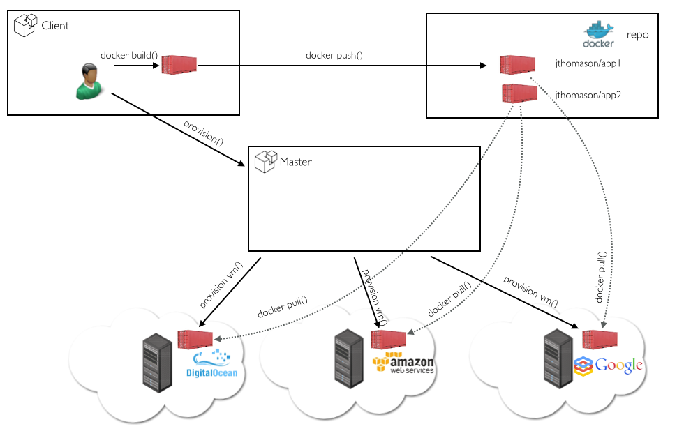
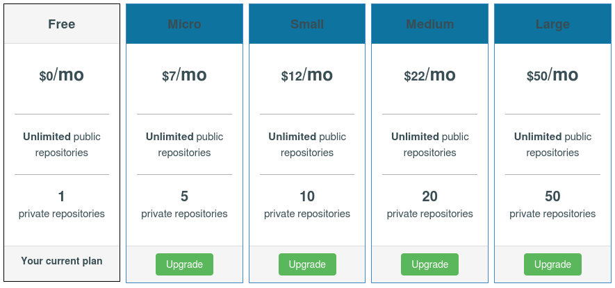
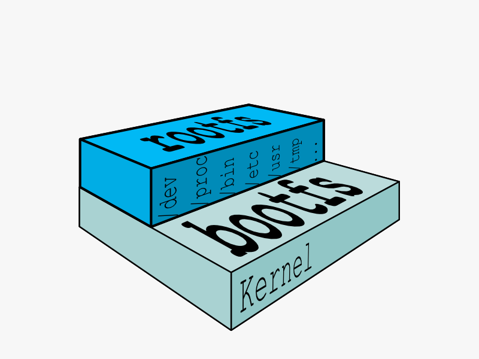
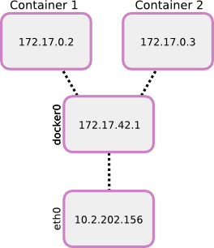
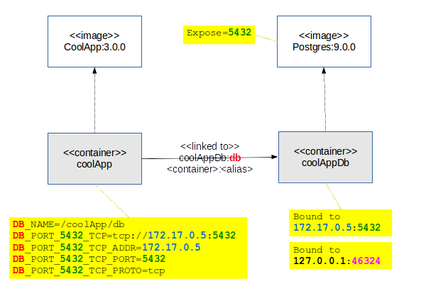
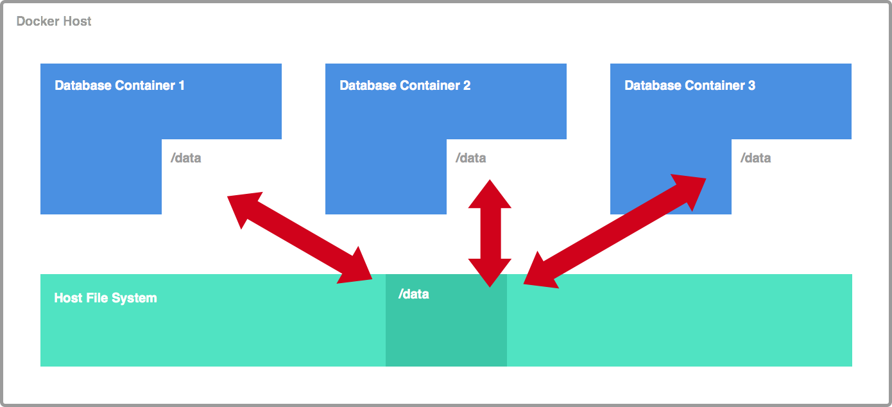

% Docker
% Daniele
% Jan 22, 2015

# Big Picture

## What is it ?

* Docker is 
	* an open source platform 
		* for 
			* developers 
			* sysadmins 
		* to 
			* build
			* ship 
			* run
				* distributed applications
								
## As sysop, you can...
* stop worring about devs not able to foresee what happens to apps in prod
* run applications that have been previously dockerized
	* in comlpete isolation (a.k.a. "Container")
		* ~ as it would happen with a VM
	* withouth the burden of sysop
		* at some extent
			
## As dev, you can...
* stop worring about the app behaving differently in different environments
* be sure that container be the same regardless of the environment they run in
	* because they are created as instances of immutable "Images"
		
## As dev, you can...
* forget about how to set up Oracle, Postgres, XXYYZZ
* setuplessly link containers
	* i.e.
		* run container#1 with "my-db" 
		* run container#2 with "my-web" app linked to "my-db"
	* applications should be built to work together (a.k.a. "dockerization")
		
## As team, you can...
* share knowledge
* extend available images in order to create new immutable images 
	* share it across you team
		* in order to have a standard environment
			
## As team, you can...
* create a repeatable environment
	* put image definitions and container creation in a script in your codebase
		* all members will have same env

## As company, you can...
* develop / deploy / run the **very same** environment
	* extend a useful image
	* including your dockerized app in it
	* share the image
	* create a container in prod from the same image

## Docker Platform
* Docker Engine
	* portable 
	* lightweight 
	* runtime
* Packaging Tool
* Docker Hub 
	* a cloud service for 
		* sharing Images of dockerized applications
		* automating workflows

## Docker runs on
* Modern Linux
	* Docker needs
		* libvirt, 
		* LXC (Linux containers) 
		* and systemd-nspawn
* Win (and maybe older Linux) through a VM
	* https://github.com/boot2docker/boot2docker
	* Azure supports Docker
	* forthcoming support in Windows Server
	
# Best Practices

## Be repeatable

Main goal is to be able to create the very same container whenever you need it.

## Be portable

Main goal is to be able to run the very same container on different platforms.

## Don't boot init

* Containers model processes not machines
* The goal is that you only run one process per container 
* So an init or supervisor is not needed 
* If the processes dies inside a container then the container dies
* Instead of restarting the process just restart the same container or a new container

##  Don't upgrade in builds

* Updates will be baked into the based images you don't need to apt-get upgrade your containers.
* If there are security updates that a base image needs, fix the Image 

##  Use small base images

Some images are more bloated than others. I suggest using debian:jessie as your base.

##  Use specific tags

Use specific tags when specifying FROM images

##  Use the cache

Keep common instructions at the top of the Dockerfile to utilize the cache.

##  EXPOSE-ing ports

* Images should able to run on any host and as many times as needed. 
* Never map the public port in a Dockerfile.

##  Log to stdout ####

The docker logs command looks inside the container and returns its standard output.
So, log to stdout to make logs available to the client.

# Pitfalls

## Deploy Infrastructure

## Fees

	
# Tech Stuffs

## Layered Filesystem

## Layered Filesystem

## Layered Filesystem

## Networking

## Linked Containers

## Volumes

	
# Demo

## Basic Usage

* search and run a container
* check docker processes
* Q&A

## Dockerfile & Docker Hub

[https://registry.hub.docker.com/u/danidemi/docker-cms/](https://registry.hub.docker.com/u/danidemi/docker-cms/)

## Dockerized App

[https://github.com/danidemi/tutorial-packer](https://github.com/danidemi/tutorial-packer)

	
	

